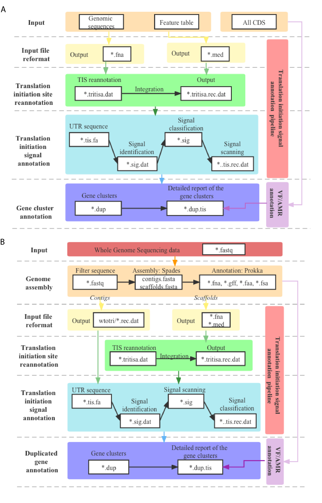

# SoDpipe

## Description
  We developed SoDpipe, an automated bioinformatic pipeline for the identification of redundant genes and translation regulatory elements. The basic protocols consist of redundant gene and translation initiation signal annotation, which in conjunction with virulence factors and resistance genes annotation facilitate large-scale analysis of evolutionary events dominated by redundant genes for prokaryotes, especially for pathogens. The pipeline can handle different types of genomic data for various implementation requirements, including but not limited to genome assembly data and whole genome sequencing data. For genome assembly data from GenBank/RefSeq, the pipeline mainly includes the identification of redundant genes, translation initiation site correction, translation initiation signal annotation, and VF/AMR annotation. Quality control, genome assembly, and genome annotation were also implemented when processing whole genome sequencing data. The final report generated contains detailed information on the redundant clusters, types of translation initiation signals (SD-like, TA-like, or no signal), signal motifs, and the start site of the signal.

## Workflow



## Installation

### Download from the website
1. Download and Install the Miniconda (Optional, depends on usage).
```
wget https://repo.anaconda.com/miniconda/Miniconda3-latest-Linux-x86_64.sh -O miniconda.sh
bash miniconda.sh -b
```
2. Download SoDpipe.
```
cd SoDpipe
conda env create --name SoDpipe --file Install/environment.yaml
conda activate SoDpipe
```
3. Install the dependencies listed in Install/Requirements and setup dbs.
```
prokka –setupdb
diamond makedb --in bin/db/CARD.faa -d bin/db/CARD
diamond makedb --in bin/db/VFDB.faa -d bin/db/VFDB
```

### Docker 
```
docker pull peihw/sodpipe:1.20
```

## Step-by-Step tutorial
### For genome assembly from GenBank/RefSeq
1. Input files
   SoDpipe takes FASTA format of the genomic sequences (*_genomic.fna), tab-delimited text file reporting annotated features (*_feature_table.txt), FASTA format of the sequences corresponding to all CDS (*_translated_cds.faa or other translated amino acid sequence) as input.
2. Configuration
   The config_a.yaml file allows you to define the parameters and their values (See SoDpipe/REAME for more details).
3. Command for an end-to-end test that will execute the entire pipeline in one go.
```
snakemake -s Snakefile.a result/duplication/GCF_000005845.2_ASM584v2.info --jobs 20
```
4. Output files
   
   \# reannotation feature file.
   result/Tritisa/GCF_000005845.2_ASM584v2.tritisa.rec.dat
   \# FASTA format of untranslated sequence upstream translation initiation site.
   result/TISseq/GCF_000005845.2_ASM584v2.tis.fa
   \#translation initiation signal annotation of all genes within the genome.
   result/records/GCF_000005845.2_ASM584v2.tis.rec.dat
   \#duplicated gene clustered at setting threshold.
   result/duplication/GCF_000005845.2_ASM584v2.dup
   \#translation initiation signal annotation of duplicated genes within the genome.
   result/duplication/GCF_000005845.2_ASM584v2.dup.tis
   \#untranslated sequence for promoter detection   
   result/TSseq/GCF_000005845.2_ASM584v2.tis.fa
   \#promoter sequence of the maximum posibility.   
   result/promoter/GCF_000005845.2_ASM584v2.mp.proseq
   \#a detailed report of the duplicated gene clusters, function annotation, virulence factors, antimicrobe resistance, types of translation initiation mechanisms, translation initiation signal motifs, and possible promoter sequences.   
   result/duplication/GCF_000005845.2_ASM584v2.info    

### For whole genome sequencing data
1. Input files
   SoDpipe also takes paired-end whole genome sequencing data (*_1.fastq, *_2.fastq) as input.
2. Configuration
   The config_s.yaml file allows you to define the parameters and their values (See SoDpipe/REAME for more details).
3. Command for an end-to-end test that will execute the entire pipeline in one go.
```
snakemake -s Snakefile.s result/duplication/SRR19707997.info --job 20
```
4. Output files
   result/spades_out/SRR19707997/    #genome assembly files.
   result/prokka_out/SRR19707997/    #genome annotation files.
   result/Tritisa/SRR19707997.tritisa.rec.dat    #reannotation feature file.
   result/TISseq/SRR19707997.tis.fa    #FASTA format of untranslated sequence upstream translation initiation site.
   result/records/SRR19707997.tis.rec.dat    #translation initiation signal annotation of all genes within the genome.
   result/duplication/SRR19707997.dup    #duplicated gene clustered at setting thresholds.   
   result/duplication/SRR19707997.dup.tis    #translation initiation signal annotation of duplicated genes within the genome.
   result/duplication/SRR19707997.info    #a detailed report of the duplicated gene clusters, function annotation, virulence factors, antimicrobe resistance, types of translation initiation mechanisms, translation initiation signal motifs, and possible promoter sequences.

## Tips
1. The run time for a genome assembly on a "normal" desktop computer is about .
2. Users can enable or disable the function of translation initiation site reannotation (See SoDpipe/REAME for more details).
3. For genomic data in other formats, We recommend reannotating the genome with Prokka and continuing the following analyses with "Snakefile.s" or "Snakefile.st". Users can edit the "Fasta" option in "config_s.yaml" with the information of your FASTA file.
